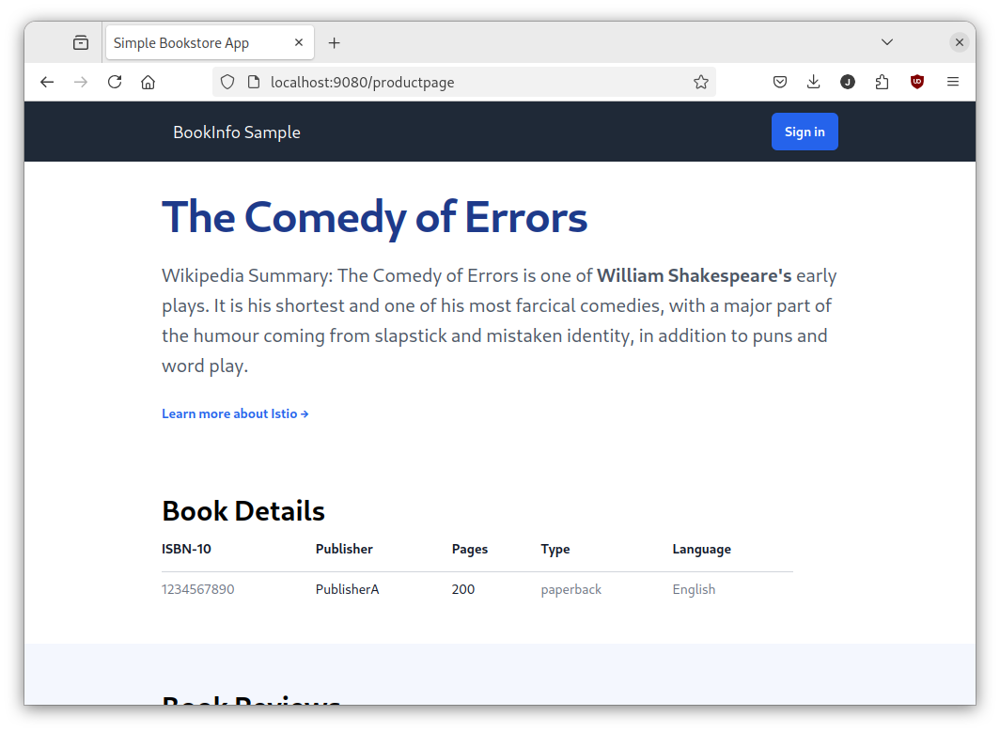
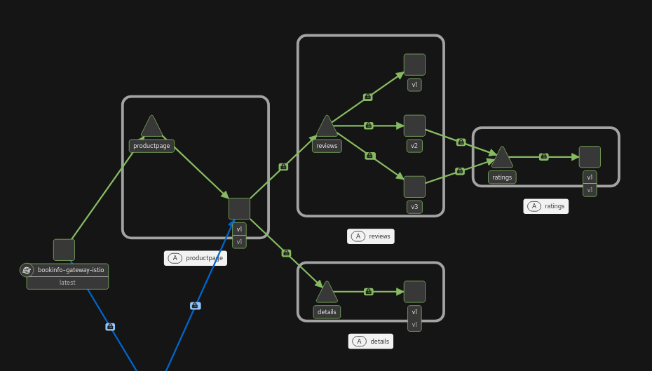

# Exercise log for Istio sample app

First installed Istio. Had to set `values.cni.cniBinDir` manually because of an [issue](https://github.com/istio/istio/pull/57110) with k3d.

``` shell
istioctl install \
  --set profile=ambient \
  --set values.global.platform=k3d \
  --set values.cni.cniBinDir=/var/lib/rancher/k3s/data/cni
```

Let's run the application:

``` shell
kubectl apply -f bookinfo/platform/kube/bookinfo.yaml
kubectl apply -f bookinfo/platform/kube/bookinfo-versions.yaml
```

Next the gateway:

``` shell
kubectl apply -f bookinfo/gateway-api/bookinfo-gateway.yaml
kubectl annotate gateway bookinfo-gateway networking.istio.io/service-type=ClusterIP --namespace=default
kubectl get gateway
```

Wait until `Programmed=True`.

Port forward:

``` shell
kubectl port-forward svc/bookinfo-gateway-istio 9080:80
```

App is now visible at http://localhost:9080/productpage



Let's add the pods to the ambient mesh:

``` shell
kubectl label namespace default istio.io/dataplane-mode=ambient
```

Enable the dashboard:

``` shell
kubectl apply -f addons/prometheus.yaml
kubectl apply -f addons/kiali.yaml
istioctl dashboard kiali
```

Do some traffic to the site:

``` shell
for i in $(seq 1 100); do curl -sSI -o /dev/null http://localhost:9080/productpage; done
```



Apply an AuthorizationPolicy:

``` shell
kubectl apply -f authorizationpolicy.yaml
```

Now fetching the service from anywhere else other than the Gateway will fail:

``` shell
kubectl apply -f curl/curl.yaml
kubectl exec deploy/curl -- curl -s "http://productpage:9080/productpage"
```
```
command terminated with exit code 56
```

Let's add a waypoint:

``` shell
istioctl waypoint apply --enroll-namespace --wait
kubectl get gateway waypoint
```

Wait until `Programmed=True`.

Now let's apply the AuthorizationPolicy for curl:

``` shell
kubectl apply -f authorizationpolicy-curl.yaml
```

Now a HTTP DELETE still fails for the curl pod:

``` shell
kubectl exec deploy/curl -- curl -s "http://productpage:9080/productpage" -X DELETE
```
```
RBAC: access denied
```

Also a HTTP GET from somewhere else still fails:

``` shell
kubectl exec deploy/reviews-v1 -- curl -s http://productpage:9080/productpage
```
```
RBAC: access denied
```

But a HTTP GET from the curl pod works:

``` shell
kubectl exec deploy/curl -- curl -s http://productpage:9080/productpage | grep -o "<title>.*</title>"
```
```
<title>Simple Bookstore App</title>
```

Finally, let's apply a weighted route:

``` shell
kubectl apply -f weighted-reviews-route.yaml
```

Now most of the traffic goes through the service `reviews-v1`:

``` shell
kubectl exec deploy/curl -- sh -c "for i in \$(seq 1 100); do curl -s http://productpage:9080/productpage | grep reviews-v.-; done"
```
```
                  reviews-v1-85964f9f98-4tghc
                  reviews-v1-85964f9f98-4tghc
                  reviews-v1-85964f9f98-4tghc
                  reviews-v1-85964f9f98-4tghc
                  reviews-v2-6f7fbdc6fd-f2kbj
                  reviews-v2-6f7fbdc6fd-f2kbj
                  reviews-v1-85964f9f98-4tghc
                  reviews-v1-85964f9f98-4tghc
                  reviews-v1-85964f9f98-4tghc
                  reviews-v1-85964f9f98-4tghc
                  ...
```
