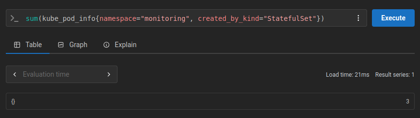

# monitoring

## Deployment

Add repos for monitoring components:

``` shell
helm repo add prometheus-community https://prometheus-community.github.io/helm-charts
helm repo add grafana https://grafana.github.io/helm-charts
helm repo update
```

Create namespace `monitoring`:

``` shell
kubectl create namespace monitoring
```

Deploy monitoring components:

``` shell
helm upgrade --install prom prometheus-community/prometheus \
  --namespace monitoring \
  --values prom-values.yaml

helm upgrade --install loki grafana/loki \
  --namespace monitoring \
  --values loki-values.yaml

helm upgrade --install k8smon grafana/k8s-monitoring \
  --namespace monitoring \
  --values k8smon-values.yaml

helm upgrade --install grafana grafana/grafana \
  --namespace monitoring \
  --values grafana-values.yaml
```

## 4.3. Querying in Prometheus

Query number of pods created by StatefulSets in `monitoring` namespace. The exercise says `prometheus` namespace, but I have them under `monitoring` as per the exercise in Chapter 3.


