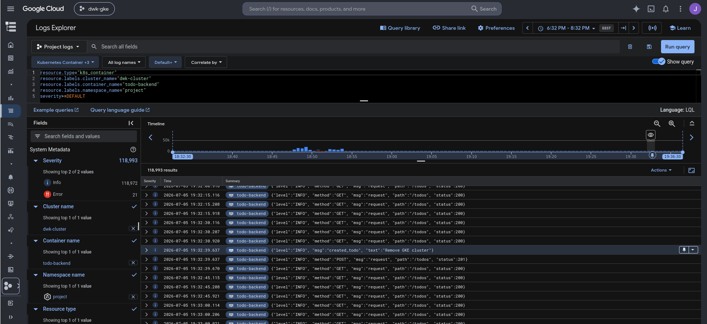

# the-project

## Deployment

Ensure namespace `project` exists:

``` shell
kubectl create namespace project
```

Create a Discord bot and add it to a server of your choosing.

Create a secret for the Discord credentials:

``` shell
kubectl create secret generic broadcaster \
    --namespace=project \
    --from-literal=token=<discord bot token> \
    --from-literal=channel=<channel id to send messages to>
```

Create shared resources:

``` shell
kubectl apply -k ../shared
```

Deploy:

``` shell
kubectl apply -k .
```

## 3.9. DBaaS vs DIY

Using a DBaaS solution, where the database is handled by a third-party provider, can make it so that you can worry less about the more difficult parts about handling databases, such as high availability, scalability and backups [1]. This will obviously cost money but it can reduce in-house operational costs compared to a DIY solution. When the application has a high workload, it could be quite difficult to set up a database that can handle it reliably since any downtime could cost a lot of money. Although, it could be the case that for a smaller application, a DIY solution could be cheaper, even when there is a higher initial setup cost of the solution, since in the longer run, it could be the case that it is essentially set-and-forget, if properly set up. But with things such as backups, a proper and secure setup might not be so trivial, since you need to be sure that the backups don't suddenly stop working without notice, and that they are actually recoverable in emergency and securely stored in more than one place etc. And you are also responsible for other maintenance such as updating the software versions of the database and responding to any downtime anomalies. A DBaaS solution can provide a simple interface for all of these things, and they might be handled by people who have though about these things longer and better.

[1]: https://www.ibm.com/think/topics/dbaas

## 3.12. Logs Explorer in Google Cloud


