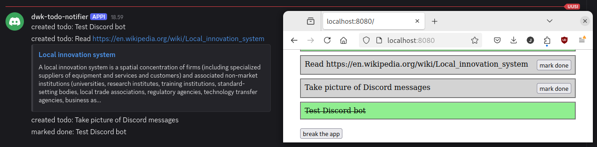

# broadcaster

Sends todo updates to Discord.



## Startup

``` shell
NATS_URL=<nats api> DISCORD_TOKEN=<discord bot token> DISCORD_CHANNEL_ID=<discord channel id> go run .
```

## Deployment

You probably want to deploy the whole stack, see `../README.md`. Here is deployment for `broadcaster` only:

Ensure namespace `project` exists:

``` shell
kubectl create namespace project
```

Create a Discord bot and add it to a server of your choosing.

Create a secret for the Discord credentials:

``` shell
kubectl create secret generic broadcaster \
    --namespace=project \
    --from-literal=token=<discord bot token> \
    --from-literal=channel=<channel id to send messages to>
```

Deploy:

``` shell
kubectl apply -k .
```
